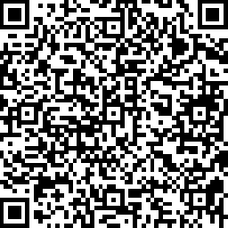

Clicca sul bottone in basso per salvare l'evento in formato .ics sul tuo calendario

<button onclick="window.location.href = 'assets/revealjs/walterefrancesca_ics.ics';">Save the Date!</button>

oppure inquadra il QR Code per salvare l'evento in formato .ics sul tuo calendario

